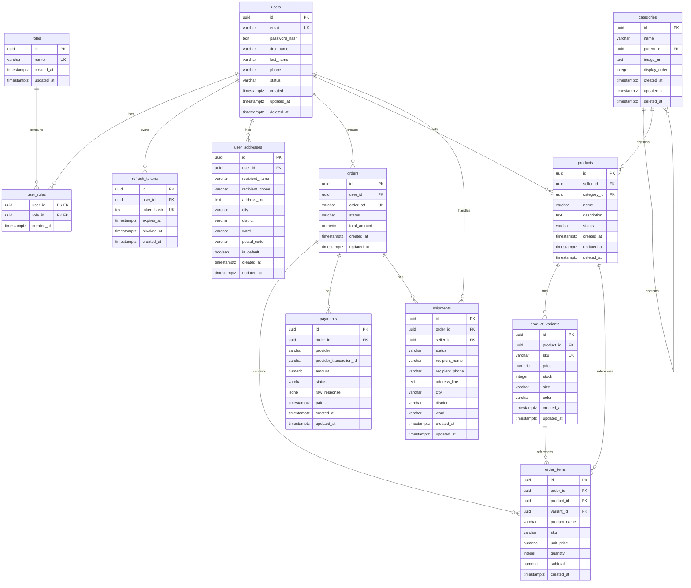

# Database Design

## Overview

Database được thiết kế cho hệ thống thương mại điện tử bằng PostgreSQL.

Các nguyên tắc chính:

- Sử dụng UUID cho primary key.
- Sử dụng `timestamptz` cho thời gian.
- Không lưu password dạng plain text.
- Sử dụng foreign key để đảm bảo toàn vẹn dữ liệu.
- Sử dụng `numeric(14,2)` cho giá trị tiền.
- Cart được lưu bằng Redis.
- Order item lưu snapshot thông tin sản phẩm tại thời điểm đặt hàng.
- Migration được tách theo từng module.

## Entity Relationship Diagram



## Table Responsibilities

### users

Lưu thông tin tài khoản người dùng.

Các loại user được phân quyền thông qua bảng `roles`:

- `admin`
- `customer`
- `seller`

Password chỉ được lưu dưới dạng `password_hash`.

### roles

Lưu danh sách role của hệ thống.

Tên role được đặt unique để tránh tạo trùng role.

### user_roles

Là bảng trung gian cho quan hệ nhiều-nhiều giữa user và role.

Một user có thể có nhiều role và một role có thể được gán cho nhiều user.

### refresh_tokens

Lưu refresh token dưới dạng hash.

Không lưu refresh token gốc trong database. Token có thể bị:

- Hết hạn.
- Revoke khi logout.
- Revoke khi token rotation.

### user_addresses

Lưu nhiều địa chỉ giao hàng của user.

Một user có thể có nhiều địa chỉ nhưng chỉ nên có một địa chỉ mặc định.

### categories

Lưu danh mục sản phẩm.

`parent_id` cho phép tạo category cha-con:

```text
Electronics
  ├── Phones
  └── Laptops
```

### products

Lưu thông tin chung của sản phẩm.

Stock và price không đặt trực tiếp ở bảng này vì một sản phẩm có thể có nhiều variant.

### product_variants

Lưu SKU, giá, stock và thuộc tính của từng phiên bản sản phẩm.

Ví dụ:

```text
Product: T-Shirt
Variant: T-Shirt / Size M / Color Black
SKU: TS-BLACK-M
```

Stock được quản lý ở cấp variant.

### orders

Lưu thông tin tổng quan của đơn hàng.

Order có trạng thái:

```text
pending
confirmed
paid
shipping
completed
cancelled
```

### order_items

Lưu các sản phẩm bên trong order.

Các field như `product_name`, `sku`, `unit_price` được lưu lại như snapshot. Điều này đảm bảo lịch sử order không bị thay đổi khi sản phẩm thay đổi sau này.

### payments

Lưu thông tin thanh toán của order.

Payment provider có thể là:

```text
vnpay
cash
bank_transfer
```

`raw_response` dùng kiểu `jsonb` để lưu response từ payment provider phục vụ debug và audit.

### shipments

Lưu thông tin giao hàng.

Một order có thể có nhiều shipment nếu hệ thống hỗ trợ nhiều seller.

Địa chỉ giao hàng được snapshot tại thời điểm tạo shipment để tránh bị thay đổi khi user cập nhật địa chỉ sau đó.

## Redis Data

Cart không lưu trong PostgreSQL.

Redis key được đề xuất:

```text
cart:{user_id}
```

Ví dụ:

```text
cart:550e8400-e29b-41d4-a716-446655440000
```

Cart item có thể lưu:

```json
{
  "variant_id": "uuid",
  "quantity": 2
}
```

Thông tin sản phẩm và giá hiện tại được lấy từ PostgreSQL khi hiển thị cart hoặc tạo order.

## Data Integrity Rules

### User

- Email phải unique.
- Email nên được tìm kiếm không phân biệt chữ hoa/chữ thường.
- User bị xóa theo soft delete.
- Password không được trả về API response.

### Product

- SKU phải unique.
- Giá không được âm.
- Stock không được âm.
- Quantity phải lớn hơn 0.
- Product status chỉ nhận:
  - `draft`
  - `published`
  - `archived`

### Order

- Order phải thuộc về một user.
- Order item phải thuộc về một order.
- Tổng tiền không được âm.
- Không cho phép stock âm.
- Các thay đổi stock phải nằm trong database transaction.

### Payment

- Payment phải thuộc về một order.
- Provider transaction ID không được trùng.
- Webhook payment phải hỗ trợ idempotency.
- Không cập nhật order thành `paid` nhiều lần.

## Migration Order

Migration nên được triển khai theo thứ tự:

```text
000001_create_auth_tables
  ├── users
  ├── roles
  ├── user_roles
  ├── refresh_tokens
  └── user_addresses

000002_create_catalog_tables
  ├── categories
  ├── products
  └── product_variants

000003_create_order_tables
  ├── orders
  ├── order_items
  └── shipments

000004_create_payment_tables
  └── payments
```

## Tables Not Stored in PostgreSQL

### Cart

Cart được lưu trên Redis vì:

- Truy cập nhanh.
- Có thể đặt TTL.
- Dữ liệu cart thường xuyên thay đổi.
- Phù hợp với dữ liệu tạm thời.

### Bank Accounts

Thông tin bank account của seller sẽ được thiết kế riêng khi phát triển chức năng seller payout.

Không nên lưu thông tin ngân hàng nhạy cảm dưới dạng plain text.

## Application Flow

```text
HTTP Request
    -> Controller
    -> Service
    -> Repository
    -> PostgreSQL / Redis
```

Khi tạo order:

```text
Read cart from Redis
    -> Validate product and stock
    -> Begin PostgreSQL transaction
    -> Create order
    -> Create order items
    -> Decrease stock
    -> Create pending payment
    -> Commit transaction
    -> Clear cart from Redis
```

Nếu một bước trong transaction thất bại:

```text
Rollback all database changes
```

Nhờ đó order và stock luôn nhất quán.
